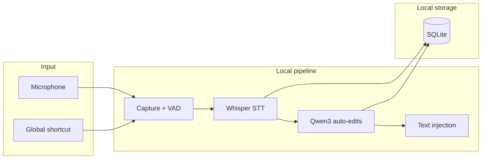

<p align="center">
  
</p>

<h1 align="center">Calliop</h1>

<p align="center">
  <strong>Universal voice dictation, 100% local.</strong><br />
  Speak into any application — transcription and AI post-processing run on your machine, with no cloud.
</p>

<p align="center">
  <a href="https://github.com/Lappom/Calliop/releases"></a>
  <a href="LICENSE"></a>
  <a href="https://github.com/Lappom/Calliop/actions/workflows/ci.yml"></a>
  
  
</p>

<p align="center">
  <a href="https://github.com/Lappom/Calliop/releases">Download</a> ·
  <a href="docs/user-guide.md">User guide</a> ·
  <a href="docs/installation.md">Installation</a> ·
  <a href="CONTRIBUTING.md">Contributing</a>
</p>

---

## Why Calliop?

Calliop is an **open-source** alternative to [Wispr Flow](https://wisprflow.ai/): global dictation, Whisper transcription, and optional AI cleanup — **without sending your voice or text to a remote service**.

| | Calliop |
|---|---|
| **Privacy** | Audio and ML inference run locally |
| **Integration** | Text injection into any Windows application |
| **Quality** | Whisper (`small`, `distil-fr-dec16`) + local Qwen3 for auto-edits |
| **Customization** | Personal dictionary, snippets, per-app tone, FTS history |
| **Transparency** | Source code under AGPL-3.0, no account required |

> **Network usage:** only the initial model download (~466 MB) and optional auto-updates use the Internet. Dictation itself works fully offline.

---

## Features

- **Global dictation** — `Alt + Space` shortcut (toggle or push-to-talk) in any app
- **Local transcription** — Whisper via [whisper.cpp](https://github.com/ggerganov/whisper.cpp), optional Vulkan GPU acceleration
- **AI auto-edits** — filler removal, punctuation, and light rephrasing via Qwen3 (llama.cpp sidecar)
- **Overlay & tray** — visual state indicator, system tray icon, auto-start
- **Dictionary & snippets** — learned corrections, custom voice shortcuts
- **Per-app context** — tone adapted to the active app (Slack, email, IDE…)
- **History & insights** — full-text search, latency, words/min, usage by app
- **Bilingual UI** — French and English

---

## Installation

**Windows 10/11** (supported platform in v1)

1. Download the installer from [GitHub Releases](https://github.com/Lappom/Calliop/releases):
   - `Calliop_*_x64-setup.exe` (NSIS, recommended) or `.msi`
2. Install [WebView2 Runtime](https://developer.microsoft.com/microsoft-edge/webview2/) if needed.
3. Accept the SmartScreen warning (unsigned binaries in v1).
4. On first launch, the Whisper model downloads automatically (~466 MB).

Full guide: [docs/installation.md](docs/installation.md)

> **macOS / Linux:** experimental artifacts (DMG, AppImage, deb) are provided unsigned and untested for v1 — use at your own risk.

---

## Quick start

1. Launch Calliop — an icon appears in the system tray.
2. Press **`Alt + Space`** to start dictation (release after 400 ms for push-to-talk mode).
3. Speak — the overlay shows listening, processing, and injection states.
4. Text is inserted into the active application.

Full guide: [docs/user-guide.md](docs/user-guide.md) · Troubleshooting: [docs/troubleshooting.md](docs/troubleshooting.md)

---

## Architecture



| Layer | Technology |
|-------|------------|
| Desktop shell | [Tauri 2](https://v2.tauri.app/) |
| UI | React 19, TypeScript, Tailwind CSS 4 |
| Audio | [cpal](https://github.com/RustAudio/cpal), VAD |
| STT | [whisper-rs](https://github.com/tazz4843/whisper-rs) (whisper.cpp) |
| LLM | Qwen3 via `calliop-llm-worker` sidecar (llama.cpp) |
| Injection | Clipboard + keyboard simulation ([enigo](https://github.com/enigo-rs/enigo)) |
| Persistence | SQLite (settings, history, dictionary) |

---

## Development

### Prerequisites (Windows)

- [Rust](https://rustup.rs/) (stable)
- [Node.js](https://nodejs.org/) 20+
- [pnpm](https://pnpm.io/installation) 10+
- [WebView2 Runtime](https://developer.microsoft.com/microsoft-edge/webview2/)
- [Visual Studio Build Tools](https://visualstudio.microsoft.com/visual-cpp-build-tools/) — "Desktop development with C++" workload
- [CMake](https://cmake.org/download/) 4.x (`winget install Kitware.CMake`)

### Run in dev

```powershell
pnpm install
pnpm tauri:dev
```

> Use `pnpm tauri:dev` (not `pnpm tauri dev`) — the script ensures CMake 4.x is available and builds the LLM sidecar.

### CLI tests (isolated modules)

From `src-tauri/`:

```powershell
cargo run --bin test-audio -- record 3s output.wav
cargo run --bin test-stt -- output.wav
cargo run --bin test-inject -- "Hello, this is a test"
cargo run --bin test-llm -- "uh hello so yeah"
```

### Pre-PR checks

```powershell
pnpm typecheck && pnpm lint
cd src-tauri
cargo fmt --check
cargo clippy --all-targets --all-features -- -D warnings
cargo test
```

### Build installer

```powershell
pnpm tauri build --features gpu
```

Artifacts land in `src-tauri/target/release/bundle/`.

---

## Project structure

```
src-tauri/src/
  audio/       # Microphone capture, VAD
  stt/         # Whisper bindings
  llm/         # Local post-processing (sidecar)
  inject/      # Text injection
  hotkey/      # Global shortcuts
  store/       # SQLite (config, history)
  pipeline/    # Dictation orchestration
src/
  components/  # Overlay, settings, onboarding
  hooks/
  lib/
crates/
  calliop-llm-worker/   # llama.cpp sidecar
  calliop-prompt/       # LLM prompts
```

Full roadmap: [PLAN.md](PLAN.md)

---

## Documentation

| Document | Description |
|----------|-------------|
| [User guide](docs/user-guide.md) | Shortcuts, settings, features |
| [Installation](docs/installation.md) | Installers, first launch, uninstall |
| [Troubleshooting](docs/troubleshooting.md) | Microphone, injection, models, logs |
| [STT benchmarks](docs/benchmarks.md) | Whisper accuracy and latency |
| [Release v0.1.0](releases/v0.1.0.md) | Release notes |
| [Contributing](CONTRIBUTING.md) | Workflow, conventions, releases |

---

## Contributing

Contributions are welcome — please respect the **offline-first** constraint for the core (no cloud calls for STT, LLM, or injection).

1. Fork → branch `feature/short-name`
2. Implement with the checks above
3. Open a PR with a clear description and test plan

See [CONTRIBUTING.md](CONTRIBUTING.md) for details.

---

## Known limitations (v0.1.0)

- Windows binaries are **unsigned** (SmartScreen warning)
- ML models download separately on first use
- Auto-updates are enabled by default (disable in Settings → Advanced)
- Official support is **Windows only** in v1

---

## License

[AGPL-3.0](LICENSE) — Copyright © Calliop Contributors

If you modify Calliop and distribute it (including as a SaaS), you must publish your changes under the same license.
